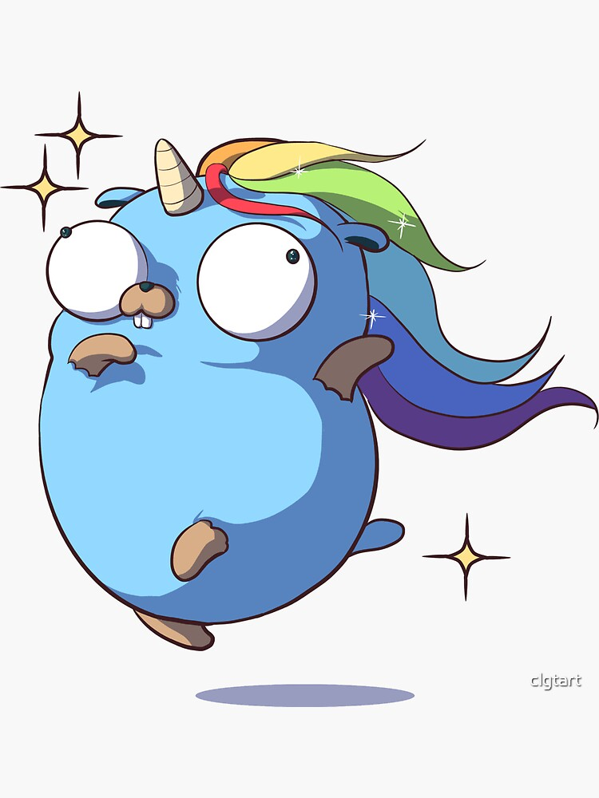

# Pokemon-Go

> Code challenge from IBM Quantum implemented in Go

The definition of the code challenge is [here](https://github.com/IBMQuantum/backend-code-challenge).

See [the developer notes](docs/DEV-NOTES.md)
